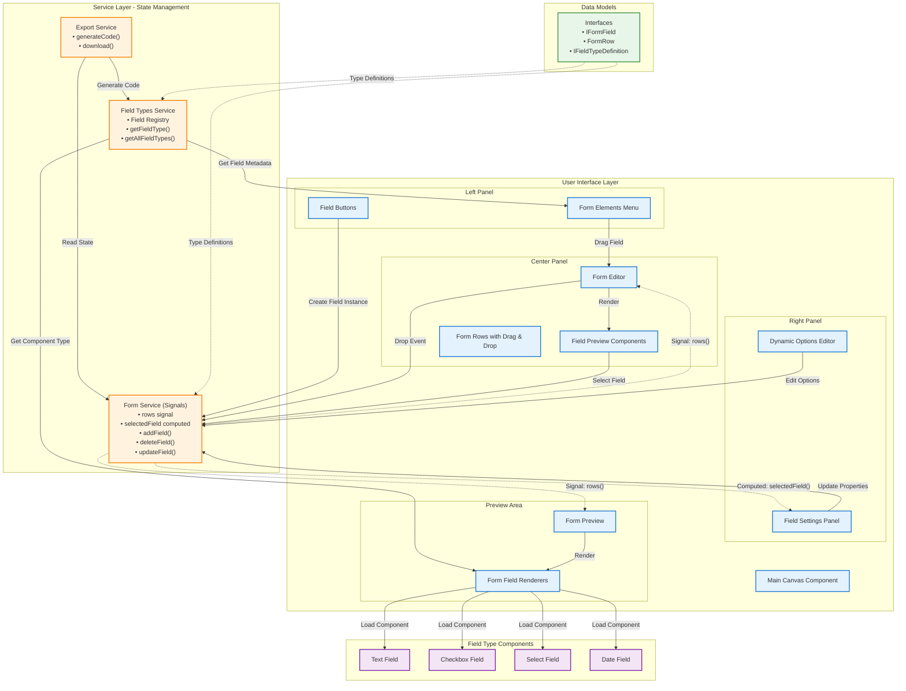
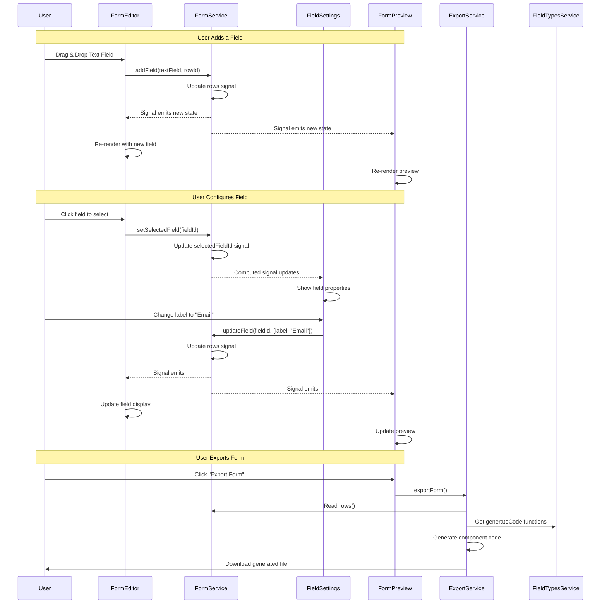

# Dynamic Form Builder

A powerful visual form designer application built with **Angular 21**, **Angular Material 3**, **Tailwind CSS 4**, and **CDK Drag & Drop**. This tool enables developers and designers to create professional, accessible forms through an intuitive drag-and-drop interface, configure field properties in real-time, and export production-ready Angular code.

Live app: [Dynamic Form Builder](https://azadnio.github.io/dynamic-form-builder/)

## Features

### Visual Design
- **Drag-and-Drop Interface**: Intuitive visual form designer with real-time preview
- **Multi-Row Layouts**: Organize fields in flexible rows with responsive design
- **Live Preview**: Instant visual feedback as you build and configure your form
- **Field Reordering**: Easily rearrange fields with smooth animations

### Field Types
- **Text Fields**: Support for text, number, email, password, and phone input types
- **Checkboxes**: Boolean input controls
- **Select Fields**: Dropdown menus with customizable options
- **Date Fields**: Calendar-based date pickers
- **Extensible Architecture**: Easy to add custom field types

### Configuration & Customization
- **Property Panel**: Edit field properties (label, placeholder, validation, options) in real-time
- **Dynamic Options Editor**: Configure select field options on the fly
- **Validation Settings**: Set required fields and input constraints
- **Field-Specific Settings**: Each field type has tailored configuration options

### Code Generation & Export
- **Export to Angular Component**: Generate production-ready TypeScript component code
- **Material Design Output**: Exported forms use Angular Material components
- **Responsive Code**: Generated forms include Tailwind CSS utilities for responsive layouts

### Design System
- **Material 3 Design System**: Full integration with Material Design 3 theming
- **Tailwind CSS 4**: Modern utility-first styling with comprehensive color tokens
- **Automatic Theme Support**: Seamless light/dark mode integration
- **Accessible Components**: Built following WCAG accessibility guidelines

## Project Structure

```
src/
├── app/
│   ├── components/
│   │   ├── field-settings/           # Field property configuration panel
│   │   │   ├── field-settings.ts     # Main settings component
│   │   │   └── dynamic-options.ts    # Dynamic select options editor
│   │   │
│   │   ├── field-types/              # Field component library
│   │   │   ├── text-field/           # Text input (text, email, password, etc.)
│   │   │   ├── checkbox-field/       # Checkbox component
│   │   │   ├── select-field/         # Dropdown select component
│   │   │   └── date-field/           # Date picker component
│   │   │
│   │   ├── form-elements-menu/       # Available field types palette
│   │   │   ├── form-elements-menu.ts # Menu container
│   │   │   └── field-button/         # Individual field type button
│   │   │
│   │   └── main-canvas/              # Primary editor workspace
│   │       ├── main-canvas.ts        # Main container component
│   │       ├── form-editor/          # Interactive form builder
│   │       ├── form-preview/         # Live form preview
│   │       ├── form-field/           # Field wrapper component
│   │       └── field-preview/        # Field preview in editor
│   │
│   ├── models/                        # TypeScript interfaces & types
│   │   ├── field.ts                  # Field definitions & configurations
│   │   └── form.ts                   # Form structure models
│   │
│   ├── services/                      # State management & business logic
│   │   ├── field-types.ts            # Field type registry & metadata
│   │   ├── form.ts                   # Form state management (signals)
│   │   └── download-form.ts          # Code generation & export
│   │
│   ├── themes/                        # Custom theme files
│   │   └── greentheme.css            # Custom Material theme
│   │
│   ├── app.ts                        # Root component
│   ├── app.config.ts                 # Application configuration
│   └── app.routes.ts                 # Route definitions
│
├── material-theme.scss                # Material Design 3 theme setup
├── styles.css                         # Global styles & Tailwind theme
└── index.html                         # Application entry point
```

## Getting Started

### Prerequisites

- **Node.js** 18 or higher
- **npm** 10.9.2 or higher
- **Angular CLI** 21.1.1 or higher

### Installation

1. Clone the repository:
   ```bash
   git clone <repository-url>
   cd dynamic-form-builder
   ```

2. Install dependencies:
   ```bash
   npm install
   ```

## Development

Start the development server:

```bash
npm start
```

The application will be available at `http://localhost:4200/`. The app automatically reloads when source files change.

### Development Server Features
- Hot module replacement for fast iteration
- Live reload on file changes
- Source maps for debugging

## Building

Build the project for production:

```bash
npm run build
```

Production builds are optimized and stored in the `dist/` directory. The build process includes:
- Tree-shaking to remove unused code
- Minification for smaller bundle sizes
- Ahead-of-time (AOT) compilation
- Build optimization for performance

### Watch Mode

For continuous development builds:

```bash
npm run watch
```

## Testing

Execute unit tests with Vitest:

```bash
npm test
```

The test suite uses Vitest for fast, modern testing with excellent TypeScript support.

## Technologies Used

### Core Framework
- **Angular 21** - Modern web framework with signals and standalone components
- **TypeScript 5.9** - Type-safe programming language
- **RxJS 7.8** - Reactive programming library for asynchronous operations

### UI & Styling
- **Angular Material 21** - Material Design 3 component library
- **Angular CDK 21** - Component development kit (drag-and-drop, overlays)
- **Tailwind CSS 4** - Utility-first CSS framework with modern features
- **PostCSS 8** - CSS transformation and processing

### Development Tools
- **Angular CLI 21** - Command-line interface for Angular development
- **Vitest** - Fast unit testing framework
- **Prettier** - Code formatting

### Key Dependencies
```json
{
  "@angular/cdk": "~21.1.2",
  "@angular/material": "~21.1.2",
  "@tailwindcss/postcss": "^4.1.12",
  "tailwindcss": "^4.1.12"
}
```

## Architecture

### System Architecture Diagram



#### Architecture Legend
- **Solid arrows** (→): Direct function calls or data passing
- **Dashed arrows** (-.->): Reactive signal subscriptions (automatic updates)
- **Blue**: User Interface Components
- **Orange**: Service Layer (State & Logic)
- **Purple**: Field Type Components
- **Green**: Data Models & Interfaces

### Communication Flow



### Design Philosophy

This application follows modern Angular best practices with a focus on maintainability, type safety, and developer experience. The architecture is designed for easy navigation and extension.

**Core Principles**

- **Standalone Components**: All components are standalone, eliminating the need for NgModules and providing better tree-shaking
- **Signal-Based State**: Uses Angular signals for reactive state management, providing better performance and simpler mental models than traditional RxJS patterns
- **Service-Oriented Architecture**: Business logic and state are centralized in services, keeping components focused on presentation
- **Type Safety**: Comprehensive TypeScript interfaces ensure compile-time safety across the application
- **Feature-Based Organization**: Related components are grouped by feature for intuitive code navigation

### Application Structure

```
src/app/
├── app.ts                        # Root component
├── app.config.ts                 # Application configuration & providers
├── app.routes.ts                 # Route definitions
│
├── components/                   # Feature components
│   ├── main-canvas/              # Primary editor container
│   │   ├── main-canvas.ts        # Main canvas component
│   │   ├── form-editor/          # Form editing interface
│   │   │   └── form-editor.ts
│   │   ├── form-preview/         # Real-time form preview
│   │   │   └── form-preview.ts
│   │   ├── form-field/           # Individual field renderer
│   │   │   └── form-field.ts
│   │   └── field-preview/        # Field preview in editor
│   │       └── field-preview.ts
│   │
│   ├── form-elements-menu/       # Field type selector
│   │   ├── form-elements-menu.ts
│   │   └── field-button/         # Individual field type button
│   │       └── field-button.ts
│   │
│   ├── field-settings/           # Property configuration panel
│   │   ├── field-settings.ts
│   │   └── dynamic-options.ts    # Dynamic options editor
│   │
│   └── field-types/              # Reusable field components
│       ├── text-field/
│       │   └── text-field.ts
│       ├── checkbox-field/
│       │   └── checkbox-field.ts
│       ├── select-field/
│       │   └── select-field.ts
│       └── date-field/
│           └── date-field.ts
│
├── models/                       # Data models & interfaces
│   ├── field.ts                  # Field interface & type definitions
│   └── form.ts                   # Form interface & structure
│
├── services/                     # Business logic & state management
│   ├── field-types.ts            # Field type registry & metadata
│   ├── form.ts                   # Form state & operations (signals)
│   └── download-form.ts          # Code generation & export service
│
├── themes/                       # Custom themes
│   └── greentheme.css            # Custom Material theme
│
└── utils.ts/                     # Utility functions
    └── view-transition.ts        # View transition helpers
```

### Component Responsibilities

- **Main Canvas**: Orchestrates the three-panel layout (menu, editor, settings) and manages the overall workspace
- **Form Editor**: Manages form structure, handles drag-and-drop events, and coordinates field add/remove/reorder operations
- **Form Elements Menu**: Displays available field types as draggable buttons that can be added to the form
- **Field Settings**: Provides a dynamic property editor for the currently selected field with type-specific configuration options
- **Field Preview**: Renders fields in the editor with visual indicators and interaction handles
- **Form Preview**: Displays a live, interactive preview of the form as it would appear to end users
- **Field Type Components**: Self-contained components for each field type (text, checkbox, select, date) that handle rendering and configuration

### State Management with Signals

The application uses Angular signals for reactive state management:

```typescript
// Form Service (simplified)
class Form {
  private _rows = signal<FormRow[]>([]);
  private _selectedFieldId = signal<string | null>(null);
  
  public readonly rows = this._rows.asReadonly();
  public readonly selectedField = computed(() => 
    this._rows()
      .flatMap(row => row.fields)
      .find(field => field.id === this._selectedFieldId())
  );
  
  addField(field: IFormField, rowId: string) {
    this._rows.update(rows => /* add field logic */);
  }
}
```

**Benefits of Signal-Based State:**
- Automatic UI updates when state changes
- Fine-grained reactivity without manual subscriptions
- Better performance through precise change detection
- Simpler code without complex RxJS operators

### Data & Interaction Flow

1. **User Interaction**: A user action (drag-and-drop field, click to select, edit property) is captured by a component
2. **Service Call**: The component calls a method on the appropriate service (e.g., `formService.addField()`)
3. **State Update**: The service updates its internal signal-based state
4. **Reactive Propagation**: All components consuming those signals automatically detect the change
5. **UI Re-render**: Components re-render only the affected parts of the UI
6. **Preview Sync**: The preview components automatically reflect the updated form state

**Example Flow - Adding a Field:**
```
User drags text field → FormEditor.drop() → 
formService.addField() → _rows signal updates → 
FormPreview detects change → UI updates
```

### Field Type Registry

The `FieldTypes` service maintains a registry of all available field types with their metadata:

```typescript
interface IFieldTypeDefinition {
  type: string;              // Unique identifier
  label: string;             // Display name
  icon: string;              // Material icon
  defaultConfig: object;     // Default field properties
  settingsConfig: array;     // Property editor configuration
  component: Type<any>;      // Angular component class
  generateCode: (field) => string; // Code generation function
}
```

This registry pattern makes it easy to add new field types without modifying existing code.

### Styling Strategy

The application uses a hybrid approach combining Tailwind CSS utilities with Material Design 3 theming for a cohesive, professional design system.

#### Material Design 3 Integration

- **Theme Configuration**: `material-theme.scss` configures the Material Design 3 theme with system-level CSS variables
- **Component Library**: Angular Material provides pre-built, accessible components (form fields, buttons, icons, datepickers)
- **Design Tokens**: Material generates CSS variables like `--mat-sys-primary`, `--mat-sys-surface`, etc.
- **Automatic Theming**: All Material components respect the configured theme and adapt to light/dark mode

#### Tailwind CSS 4 Integration

- **Utility Classes**: Tailwind provides responsive layout utilities (`flex`, `gap-4`, `w-full`, etc.)
- **Rapid Development**: Build layouts quickly without writing custom CSS
- **Design System Bridge**: Tailwind color tokens are mapped to Material Design System variables

#### Color System Integration

The `styles.css` file creates a comprehensive mapping between Tailwind and Material colors:

```css
@theme {
  /* Primary Colors */
  --color-primary: var(--mat-sys-primary);
  --color-on-primary: var(--mat-sys-on-primary);
  --color-primary-container: var(--mat-sys-primary-container);
  
  /* Secondary, Tertiary, Error, Surface variants... */
  --color-surface-container-high: var(--mat-sys-surface-container-high);
  --color-outline: var(--mat-sys-outline);
}
```

**Benefits:**
- Use Tailwind utilities like `bg-primary`, `text-on-surface`, `border-outline`
- Colors automatically sync with Material theme
- Seamless light/dark mode support
- Consistent design language across custom and Material components

#### Complete Color Palette

The integration includes all Material Design 3 color roles:
- **Primary/Secondary/Tertiary** - Brand colors with container and "on" variants
- **Error** - Validation and error states
- **Surface** - Background layers (dim, bright, container levels)
- **Outline** - Borders and dividers
- **Fixed Variants** - Colors that don't change with themes
- **Utility Colors** - Scrim, shadow for overlays and elevation

- **Custom Material themes can be created in `src/app/themes/`:
- `greentheme.css` - Example custom theme
- Themes can override Material's default color palette
- Changes propagate automatically through the color mapping system

## Usage Guide

### Building a Form

1. **Add Fields**: Drag field types from the left menu onto the form editor canvas
2. **Configure Properties**: Click a field to select it, then edit its properties in the right panel
3. **Organize Layout**: Drag fields within or between rows to reorder them
4. **Add Rows**: Click "Add Row" to create new horizontal sections for multi-column layouts
5. **Preview**: View the live form preview to see how it will appear to users
6. **Export**: Click "Export Form" to download the generated Angular component code

### Supported Field Types

#### Text Field
- **Input Types**: text, number, email, password, phone
- **Configuration**: label, placeholder, required validation
- **Use Cases**: Names, addresses, email collection, passwords

#### Checkbox Field
- **Configuration**: label, required validation
- **Use Cases**: Agreements, preferences, boolean selections

#### Select Field
- **Configuration**: label, options (label/value pairs), required validation
- **Dynamic Options**: Add, edit, or remove options in real-time
- **Use Cases**: Dropdowns, category selection, country/state pickers

#### Date Field
- **Configuration**: label, required validation
- **Component**: Material datepicker with calendar UI
- **Use Cases**: Birth dates, event scheduling, date ranges

### Extending the Application

#### Adding a New Field Type

1. **Create Component** in `src/app/components/field-types/`:
```typescript
@Component({
  selector: 'app-email-field',
  standalone: true,
  template: `<mat-form-field>...</mat-form-field>`
})
export class EmailField {
  @Input() field!: IFormField;
}
```

2. **Register Field Type** in `src/app/services/field-types.ts`:
```typescript
const EMAIL_FIELD_DEFINITION: IFieldTypeDefinition = {
  type: 'email',
  label: 'Email Field',
  icon: 'email',
  defaultConfig: { label: 'Email', required: true },
  settingsConfig: [...],
  component: EmailField,
  generateCode: (field) => `<input type="email" ...>`
};
```

3. **Add to Registry**:
```typescript
this._fieldTypes.set([
  // existing types...
  EMAIL_FIELD_DEFINITION
]);
```

#### Customizing the Theme

Edit `src/app/themes/greentheme.css` or create a new theme file:
```css
@import '@angular/material' as mat;

html {
  @include mat.theme((
    color: (
      primary: mat.$blue-palette,
      tertiary: mat.$green-palette,
    ),
  ));
}
```

The Tailwind color mappings will automatically reflect your theme changes.

## Code Generation

The application includes a powerful code generation feature that exports production-ready Angular components.

### Generated Code Structure

```typescript
import { Component } from '@angular/core';
import { MatFormFieldModule } from '@angular/material/form-field';
import { MatInputModule } from '@angular/material/input';
// ... other imports

@Component({
  selector: 'app-generated-form',
  standalone: true,
  imports: [MatFormFieldModule, MatInputModule, ...],
  template: `
    <form class="flex flex-col gap-4">
      <div class="flex gap-4 flex-wrap">
        <div class="flex-1">
          <mat-form-field class="w-full" appearance="outline">
            <mat-label>Full Name</mat-label>
            <input matInput type="text" required/>
          </mat-form-field>
        </div>
      </div>
    </form>
  `,
})
export class GeneratedFormComponent {}
```

### Export Features

- **Standalone Components**: Generated code uses modern standalone component architecture
- **Material Components**: Uses Angular Material form fields for professional UI
- **Responsive Layout**: Includes Tailwind CSS classes for responsive design
- **Type Safety**: All imports and component metadata are correctly typed
- **Ready to Use**: Copy the exported code directly into your Angular project

## Performance Optimizations

- **Signals**: Fine-grained reactivity minimizes unnecessary re-renders
- **OnPush Change Detection**: Components use OnPush strategy where applicable
- **View Transitions**: Smooth animations via View Transition API
- **Lazy Loading**: Components are loaded only when needed
- **Tree Shaking**: Standalone components enable better tree-shaking
- **AOT Compilation**: Production builds use Ahead-of-Time compilation

## Browser Support

- Chrome/Edge (latest)
- Firefox (latest)
- Safari (latest)
- Modern browsers with ES2022 support

## Contributing

Contributions are welcome! Please follow these guidelines:

1. Fork the repository
2. Create a feature branch (`git checkout -b feature/amazing-feature`)
3. Commit your changes (`git commit -m 'Add amazing feature'`)
4. Push to the branch (`git push origin feature/amazing-feature`)
5. Open a Pull Request

### Development Guidelines

- Follow Angular style guide and best practices
- Use TypeScript strict mode
- Write unit tests for new features
- Ensure code is formatted with Prettier
- Use signals for reactive state management
- Keep components focused and single-purpose

## License

This project is open source and available under the MIT License.

## Learn More

### Angular Resources
- [Angular Documentation](https://angular.dev)
- [Angular Material Components](https://material.angular.dev/components)
- [Angular CDK](https://material.angular.dev/cdk/categories)

### Design System Resources
- [Material Design 3](https://m3.material.io/)
- [Tailwind CSS Documentation](https://tailwindcss.com/docs)
- [Material Color System](https://m3.material.io/styles/color/system/overview)

### Related Tools
- [Angular CLI](https://angular.dev/tools/cli)
- [Vitest](https://vitest.dev/)

## Acknowledgments

- Built with [Angular](https://angular.dev)
- UI components from [Angular Material](https://material.angular.dev)
- Styling powered by [Tailwind CSS](https://tailwindcss.com)
- Icons from [Material Symbols](https://fonts.google.com/icons)
